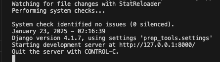

## How to run

Clone repo and cd into project root folder.
paste your .env file into the root folder


## Requirements
Make sure you have python downloaded and installed on your system. (python version 3 +)


## Let's run the project

```ls```

You should see the following folders(there might be others but these are the important ones):

```accounts     notes       prep_tools      tools       utils       manage.py       .env ```

First we need to create a virtual environment and install the dependencies. 

```python3 -m venv env``` ```

<!-- Create the virtual environment. -->```

Activating the virtual enviroment depends on your OS:

On Windows:

```env\Scripts\activate```

On macOS and Linux:

```source env/bin/activate``` 

```<!-- ^^^ We created a virtual environment called env and we are activating it. -->```

Next we have to install the dependencies.

```pip install -r requirements.txt```


If you need to do migrations, (only needed if you are changing db or you have made changes to the schema. if you are just setting up no need)

```python manage.py makemigrations```

```python manage.py migrate```


Now we can run the server.

```python manage.py runserver```




if you see unapplied migrations instead of just as it is in the screen shots then you need to do migrations.

## BRIEF INTRO
Django is divided into Project and app structure. These are respectively the entire project, and individual apps. In this case our Project is prep_tools, and the other folders are just apps.

#prep_tools/:
    main control for the entire project. 
#prep_tools/settings.py:
    project-wide settings are defined here
#prep_tools/urls.py:
    project-wide urls/routes are defined here.

The other applications of interest are acccounts and tools. They follow a similar structure so let's look at an example.:
#accounts/:
    this is a part of the project that deals with accounts. this is the accounts application.
#accounts/urls.py:
    contains accounts urls/routes.
#accounts/views.py:
    contains accounts views. the view is django's equivalent of a controller.

#utils/:
    this contains utils for certain tasks like the prompts. the folders are aptly named open_ai contains open_ai utils. etc

## API DOCUMENTATION:

http://localhost:8000/docs